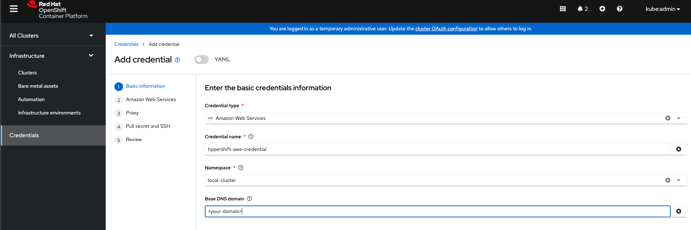

# Provision Hypershift Clusters by MCE

The multicluster-engine(MCE) has been installed and at least one OCP managed cluster. We will make this OCP managed cluster a hypershift management cluster. It is possible to use the hub cluster to act as a hypershift management cluster, however, this requires importing the hub cluster as an OCP managed cluster called `local-cluster`:

```bash
$ oc apply -f - <<EOF
apiVersion: cluster.open-cluster-management.io/v1
kind: ManagedCluster
metadata:
  labels:
    local-cluster: "true"
  name: local-cluster
spec:
  hubAcceptsClient: true
  leaseDurationSeconds: 60
EOF
```

## Enable the Hosted Control Planes related components on the hub cluster

Because Hosted Control Planes is a TP feature, the related components are disabled by default. We should enable it by editing the `multiclusterengine` resource to set the `spec.overrides.components[?(@.name=='hypershift-preview')].enabled` to `true`

```bash
$ oc get mce multiclusterengine-sample -ojsonpath="{.spec.overrides.components[?(@.name=='hypershift-preview')].enabled}"
true
```

If the value is `false`, make sure to set it true, and don't forget to change `mce-instance-name` to the name of your multicluster-engine instance:

```bash
$ oc patch mce <mce-instance-name> -n open-cluster-management --type=json -p='[{"op": "add", "path": "/spec/overrides/components/-","value":{"name":"hypershift-preview","enabled":true}}]'
```

## Turn one of the managed clusters into the HyperShift management cluster

We call the cluster with the HyperShift operator installed as the hosting service cluster (in HyperShift project terminology, it is called the management cluster). In this section, we will use hypershift-addon to install a HyperShift operator to one of the managed clusters. This step is only needed **once**, not needed for creating more clusters afterwards.

Before creating the add-on, we need to make sure to provide the details of the s3 bucket where HyperShift will be storing OIDC discovery information. The s3 bucket is a pre-req for the installation

1. If you plan to provision hosted clusters on the AWS platform, create an OIDC s3 credentials secret for the HyperShift operator, and name it `hypershift-operator-oidc-provider-s3-credentials`. It should reside in managed cluster namespace (i.e., the namespace of the managed cluster that will be used as the hosting service cluster). If you used `local-cluster`, then create the secret in the `local-cluster` namespace

The secret must contain 3 fields:

- `bucket`: An S3 bucket with public access to host OIDC discovery documents for your HyperShift clusters
- `credentials`: Credentials to access the bucket
- `region`: Region of the S3 bucket

For details, please check: [HyperShift Project Documentation](https://hypershift-docs.netlify.app/getting-started). For convenience, you can create this secret using the CLI by:

```bash
$ oc create secret generic hypershift-operator-oidc-provider-s3-credentials --from-file=credentials=$HOME/.aws/credentials --from-literal=bucket=<s3-bucket-for-hypershift> --from-literal=region=<region> -n <managed-cluster-used-as-hosting-service-cluster>
```

Add the special label to the `hypershift-operator-oidc-provider-s3-credentials` secret so that the secret is backed up for disaster recovery.

```bash
$ oc label secret hypershift-operator-oidc-provider-s3-credentials -n <managed-cluster-used-as-hosting-service-cluster> cluster.open-cluster-management.io/backup=true
```

2. Create `ManagedClusterAddon` hypershift-addon
  
```bash
$ oc apply -f - <<EOF
apiVersion: addon.open-cluster-management.io/v1alpha1
kind: ManagedClusterAddOn
metadata:
  name: hypershift-addon
  namespace: <managed-cluster-used-as-hosting-service-cluster> # the managed OCP cluster you want to install hypershift operator
spec:
  installNamespace: open-cluster-management-agent-addon
EOF
```

3. Check the `hypershift-addon` is installed
  
```bash
$ oc get managedclusteraddons -n local-cluster hypershift-addon
NAME               AVAILABLE   DEGRADED   PROGRESSING
hypershift-addon   True
```

## Provision a HyperShift hosted cluster on AWS

After the HyperShift operator is installed, we can provision a hypershift hosted cluster via the `HypershiftDeployment` customer resource.

1. Create a cloud provider secret, it has the following format for AWS:

```yaml
apiVersion: v1
metadata:
  name: my-aws-cred
  namespace: <hypershift-deployment-ns>      # Where you will create HypershiftDeployment resources
type: Opaque
kind: Secret
stringData:
  ssh-publickey:          # Value
  ssh-privatekey:         # Value
  pullSecret:             # Value, required
  baseDomain:             # Value, required
  aws_secret_access_key:  # Value, required
  aws_access_key_id:      # Value, required
```

You can create this secret using the multicluster console (embedded within the OpenShift console) or via the CLI, both options are shown below:

- Multi-cluster console: `https://<mce-multicluster-console>/multicloud/credentials/create`
  
  

- Using the CLI:

> The secret should be created where the HyperShift deployment controller is deployed. By default, it is deployed in the  `multicluster-engine` namespace.

```bash
$ oc create secret generic <my-secret> -n <hypershift-deployment-namespace> --from-literal=baseDomain='your.domain.com' --from-literal=aws_access_key_id='your-aws-access-key' --from-literal=aws_secret_access_key='your-aws-secret-key' --from-literal=pullSecret='{"auths":{"cloud.openshift.com":{"auth":"auth-info", "email":"xx@redhat.com"}, "quay.io":{"auth":"auth-info", "email":"xx@redhat.com"} } }' --from-literal=ssh-publickey='your-ssh-publickey' --from-literal=ssh-privatekey='your-ssh-privatekey'

# label the secret for backup
$ oc label secret <my-secret> -n <hypershift-deployment-namespace> cluster.open-cluster-management.io/backup=true
```

Note: `cluster.open-cluster-management.io/backup=true` is added to the secret so that the secret is backed up for disaster recovery.

1. Create a `HypershiftDeployment` in the cloud provider secret namespace

```bash
$ oc apply -f - <<EOF
apiVersion: cluster.open-cluster-management.io/v1alpha1
kind: HypershiftDeployment
metadata:
  name: hypershift-demo
  namespace: default
spec:
  hostingCluster: hypershift-management-cluster     # the hypershift management cluster name.
  hostingNamespace: clusters     # specify the namespace to which hostedcluster and noodpools belong on the hypershift management cluster.
  infrastructure:
    cloudProvider:
      name: <my-secret>
    configure: True
    platform:
      aws:
        region: <region>
        zones:
        - <availability-zone-1>
        - <availability-zone-2>
EOF
```

Check each field [definition](./../api/v1alpha1/hypershiftdeployment_types.go)

1. Check the `HypershiftDeployment` status:

```bash
$ oc get hypershiftdeployment -n <hypershift-deployment-namespace> -w
```

1. After the hosted cluster is created, it will be imported to the hub automatically, you can check it with:
  
```bash
$ oc get managedcluster <hypershiftDeployment.Spec.infraID>
```

## Provision a hypershift hosted cluster on bare-metal

Use the 'Agent' platform for HostedClusters with bare-metal worker nodes. The Agent platform uses the [Infrastructure Operator](https://github.com/openshift/assisted-service) (AKA Assisted Installer) to add worker nodes to a hosted cluster. For a primer on the Infrastructure Operator, see [here](https://github.com/openshift/assisted-service/blob/master/docs/hive-integration/kube-api-getting-started.md). In short, each bare-metal host should be booted with a Discovery Image that is provided by the Infrastructure Operator. The hosts can be booted manually or via user-provided automation, or by utilizing the [Cluster-Baremetal-Operator](https://github.com/openshift/cluster-baremetal-operator/blob/master/README.md) (CBO). Once booted, each host will run an agent process to facilitate discovering the host details and its installation. Each is represented by an Agent custom resource.

When you create a HostedCluster with the Agent platform, HyperShift will install the [Agent CAPI provider](https://github.com/openshift/cluster-api-provider-agent) in the HyperShift control plane namespace.

Upon scaling up a NodePool, a Machine will be created, and the CAPI provider will find a suitable Agent to match this Machine. Suitable means that the Agent is approved, is passing validations, is not currently bound (in use), and has the requirements specified on the NodePool Spec (e.g., minimum CPU/RAM, labels matching the label selector). You may monitor the installation of an Agent by checking its Status and Conditions.

Upon scaling down a NodePool, Agents will be unbound from the corresponding cluster. However, you must boot them with the Discovery Image once again before reusing them.

To use the Agent platform, the Infrastructure Operator must first be installed. Please see [here](https://hypershift-docs.netlify.app/how-to/agent/create-agent-cluster/) for details.

When creating the HostedCluster resource, set spec.platform.type to "Agent" and spec.platform.agent.agentNamespace to the namespace containing the Agent CRs you would like to use. For NodePools, set spec.platform.type to "Agent", and optionally specify a label selector for selecting the Agent CRs to in spec.platform.agent.agentLabelSelector.

The HypershiftDeployment would look like:

```bash
$ oc apply -f - <<EOF
apiVersion: cluster.open-cluster-management.io/v1alpha1
kind: HypershiftDeployment
metadata:
  name: hypershift-demo
  namespace: default
spec:
  hostingCluster: hypershift-management-cluster     # the hypershift management cluster name.
  hostingNamespace: clusters     # specify the namespace to which hostedcluster and noodpools belong on the hypershift management cluster.
  infrastructure:
    configure: True
    platform:
  platform:
    agent:
      agentNamespace: ${AGENT_NS}
    type: Agent
EOF
```

## Access the hosted cluster

The access secrets are stored in the {hypershift-management-cluster} namespace.
The formats of the secrets name are:

- kubeconfig secret: `<hypershiftDeployment.Spec.hostingNamespace>-<hypershiftDeployment.Name>-admin-kubeconfig` (e.g clusters-hypershift-demo-admin-kubeconfig)
- kubeadmin password secret: `<hypershiftDeployment.Spec.hostingNamespace>-<hypershiftDeployment.Name>-kubeadmin-password` (e.g clusters-hypershift-demo-kubeadmin-password)

## Destroying your hypershift Hosted cluster

Delete the HypershiftDeployment resource

```bash
$ oc delete hypershiftdeployment hypershift-demo -n default
```

## Destroying hypershift operator

Delete the hypershift-addon

```bash
$ oc delete managedclusteraddon -n <hypershift-management-cluster> hypershift-addon
```
